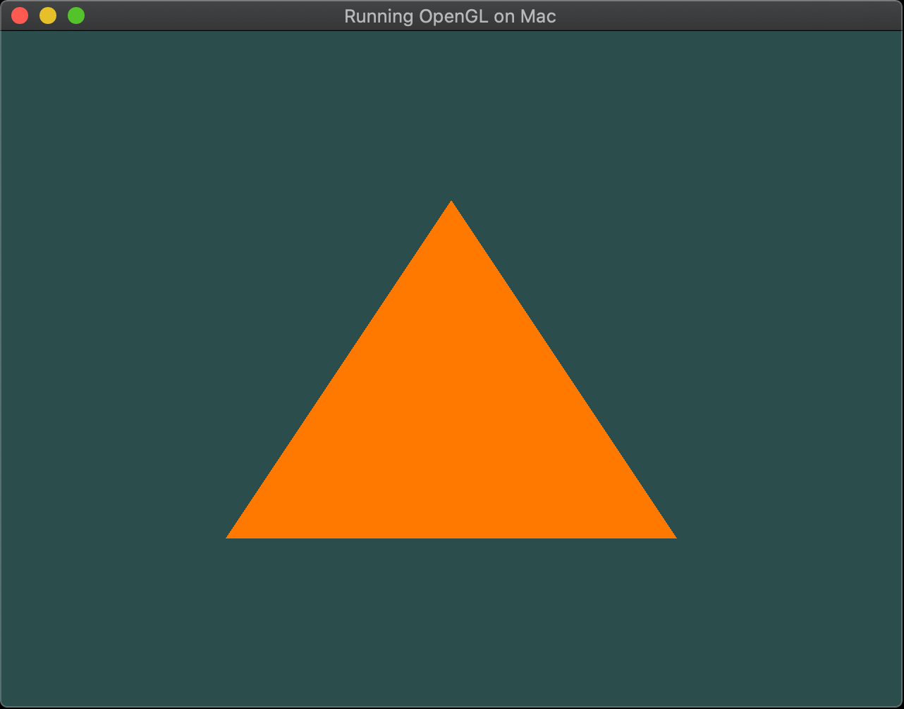

# Running OpenGL using C/C++ on MacOS

There is a good number of tutorials and code samples for MacOS out there. Those are usually based on IDE's like VSCode and XCode. More recently, there is a shift (probably a natural one) towards the trio Metal, Swift and XCode. OpenGL is already complex enough, so I thought that sharing the very bare bones of a sample code without many attachments would be useful for those either new to OpenGL or coming from a different platform.

## Development environment

I have been expanding and testing this code with the following setup:
 - MacOS Sonoma 14.2.1
 - Glfw3: 3.3.9
 - OpenGL: 4.1
 - Apple clang version: 14.2.1

With that said, this code should be supported with OpenGL greater than 3.3 (including). Just make sure that `GLFW_CONTEXT_VERSION_MAJOR`, `GLFW_CONTEXT_VERSION_MINOR` and shaders are updated accordingly.

This is a comprehensive list of OpenGL versions across different Apple products: https://support.apple.com/en-ca/HT202823

### Setting up the environment

The easiest way to install Glfw and Glew is through Homebrew. In case you don't have it, go to https://brew.sh/ and you will get it done with a single command line.

After that, glfw3 and glew can be installed with the following:
```
brew update
brew install glfw3
```

### Building the sample code

The following command is enough to generate a binary from the source code file:
```
clang -o main main.cpp -I$(brew --prefix)/include -L$(brew --prefix)/lib -lglfw -framework OpenGL
```

**Note** that different from GNU/Linux distros, MacOS has OpenGL added as a framework.


### Running the solution

Running `main` should provide a result similar to the following:



## Recommended reading
Apart from the official documentation ([OpenGL.org](https://www.opengl.org/) and [Kronos](https://www.khronos.org/registry/OpenGL/)), I suggest the following:

 - https://learnopengl.com: As an old timer I was very surprised with the quality of this tutorial.
 - https://www.glfw.org/docs/latest/: It might be prudent to get somehow familiar with the basics of GLFW.

